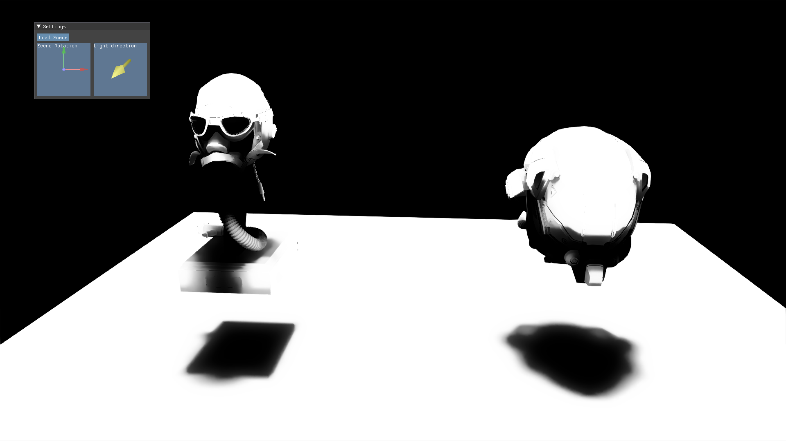

# DX12RenderEngine
DX12 Learning Toy Render

## Showcase
- Foward/Deffer Render
  
  
- Hybrid Render  
Raytracing Reflection(Denoised)

Raytracing Shadow(Denoised)

Raytracing AO(Denoised)

## Require
Assimp  
GPU/Driver that supports DXR and RTX
## Feature
### Graphics 
- PBR Material   
- IBL  
- EnvMap
- VSM
- Simple Foward Render
- Simple Deffer Render
- Simple Hybrid Render
- SVGF
### D3D12
- Bindless Resource For DXR
- Simple RenderCore(https://diligentgraphics.com/diligent-engine/architecture/d3d12/)
  - Managing Descriptor Heaps
  - Managing Resource Lifetimes
  - Managing Dynamic Resources
